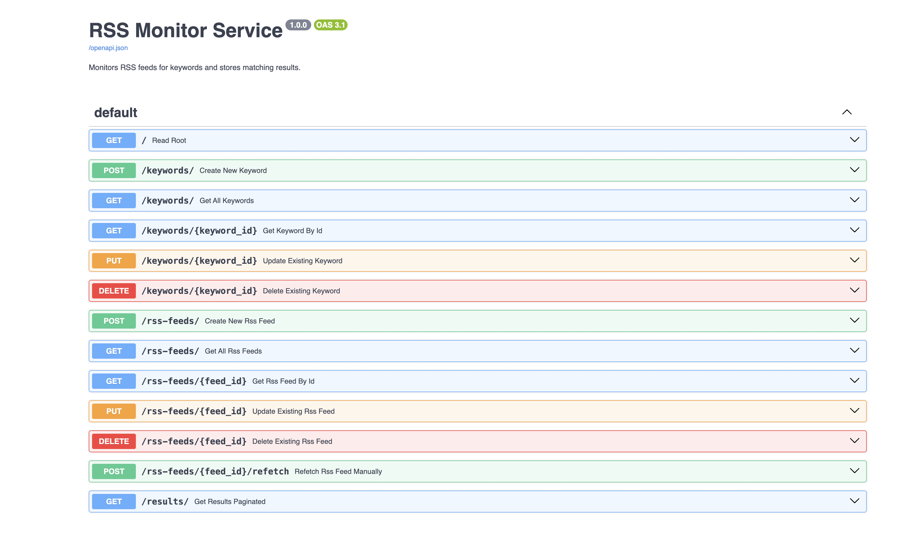
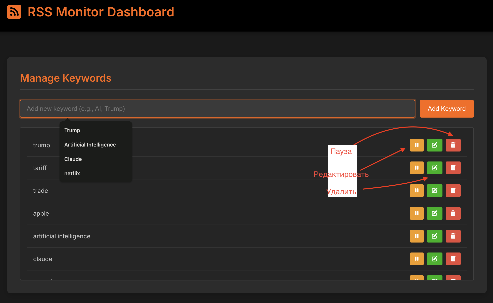
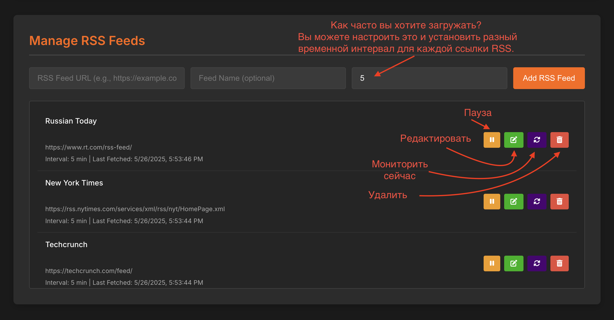
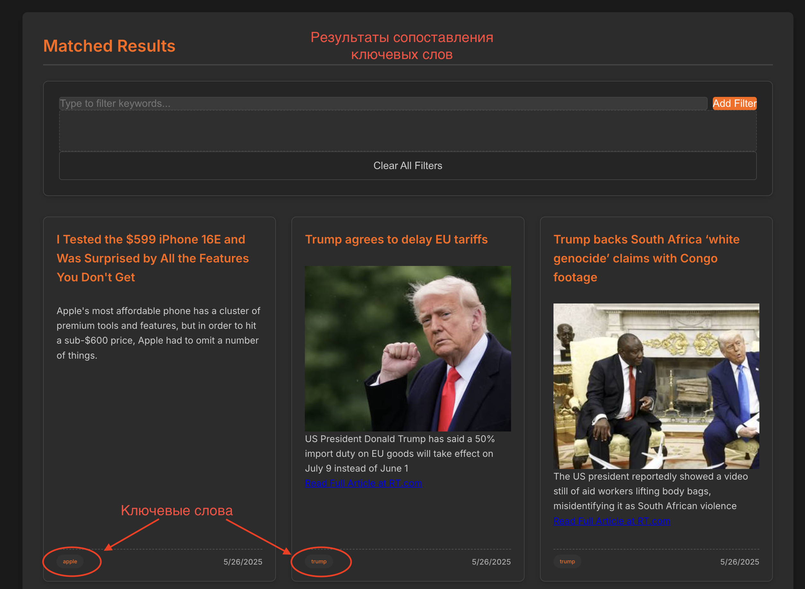
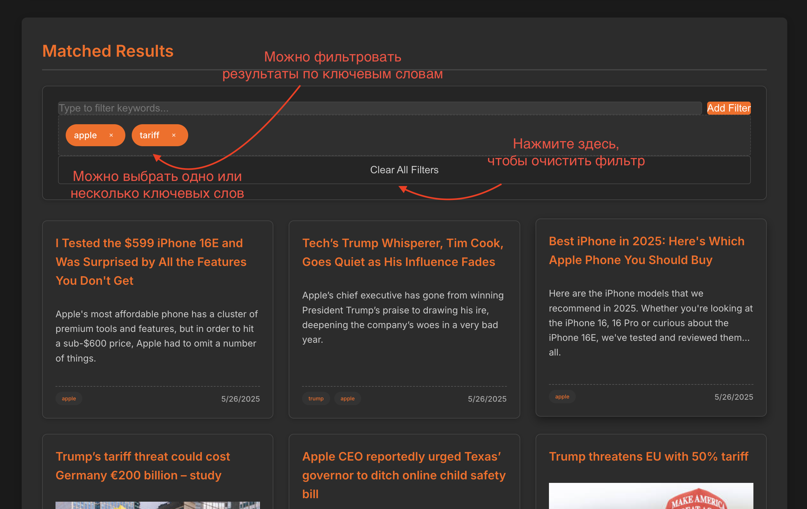
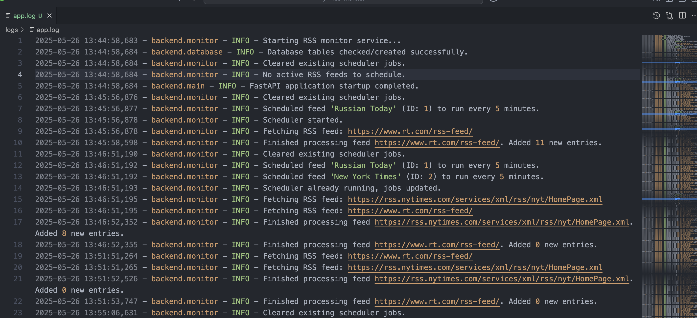
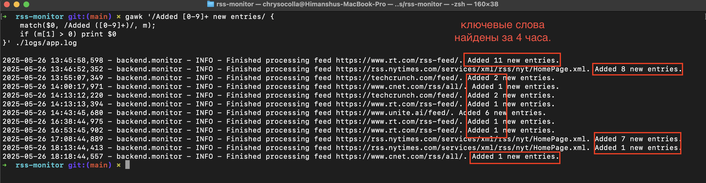
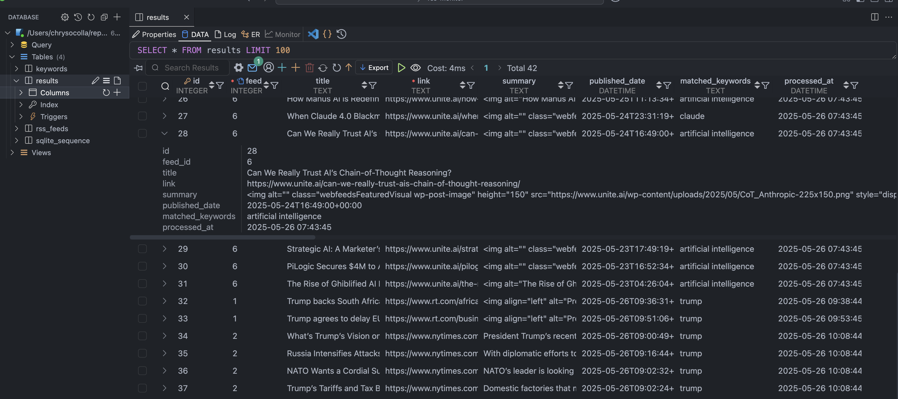

# RSS Monitor

Сервис **RSS Monitor** — это легковесное веб-приложение для отслеживания ключевых слов и тем в различных RSS- и Atom-лентах. Построенное на **FastAPI** с простым фронтендом на **vanilla JavaScript**, оно предоставляет удобную панель для мониторинга и управления актуальным контентом в режиме реального времени. Система автоматически загружает и фильтрует элементы ленты на основе заданных пользователем ключевых слов, помогая оставаться в курсе важных событий без лишних усилий.

## Требования

Перед началом убедитесь, что у вас установлены следующие компоненты:

* `Python 3.8 или новее`: Скачать можно с [python.org](https://www.python.org/)
* `pip`: менеджер пакетов Python (обычно устанавливается вместе с Python)
* `git`: для клонирования репозитория (скачать с [git-scm.com](https://git-scm.com/downloads))

### Зависимости

Проект использует следующие Python-библиотеки:

* fastapi  
* uvicorn[standard]  
* feedparser  
* pydantic
* apscheduler  

## Инструкция по установке

1. **Клонируйте репозиторий:**  

   ```bash
   git clone https://github.com/L00kAhead/rss-monitor.git
   cd rss-monitor
   ```

2. **Создайте и активируйте виртуальное окружение, затем установите зависимости:**

   ### Linux/macOS

    ```bash
    python3 -m venv venv
    source venv/bin/activate
    pip install -r requirements.txt
    ```

   ### For Windows

   ```bash
    python -m venv venv
    venv\Scripts\activate
    pip install -r requirements.txt
    ```

3. **Запустите приложение:**

    ```bash
    uvicorn backend.main:app --reload
    ```

4. **Откройте приложение в браузере:**

    ```bash
    http://127.0.0.1:8000
    ```

## Доступные URL

* **Веб-интерфейс:** [http://localhost:8000](http://localhost:8000)
* **Документация API (Swagger UI):** [http://localhost:8000/docs](http://localhost:8000/docs)
* **Альтернативная документация API (ReDoc):** [http://localhost:8000/redoc](http://localhost:8000/redoc)

## 🛠 Функциональность

* **Мониторинг по ключевым словам**

  * Сканирует заголовки и описания записей из RSS/Atom лент.
  * Поиск без учёта регистра, с точным совпадением слов.
  * Полностью настраиваемый список ключевых слов (например, AI, Trump, Crypto).

* **Управление RSS-лентами**

  * CRUD-операции (создание, просмотр, изменение, удаление) через веб-интерфейс.
  * Индивидуальные интервалы обновления для каждой ленты (по умолчанию — каждые 5 минут).
  * Пауза/возобновление мониторинга отдельных лент без их удаления.
  * Ручной запуск обновления для мгновенного получения новых данных.

* **Надёжное хранилище данных**

  * Используется SQLite3 (rss_monitor.sqlite3) для хранения:
  * Метаданных RSS-лент
  * Ключевых слов и их статуса

* **Современный веб-интерфейс**

  * Одностраничная панель управления с полной визуализацией
  * Удобное управление ключевыми словами и лентами
  * Результаты с пагинацией (12 записей на страницу)
  * Фильтрация по ключевым словам (логика “ИЛИ”)
  * Автообновление каждые 60 секунд (настраивается в script.js)
  * Адаптивный дизайн для ПК, планшетов и смартфонов

* **Эффективная фоновая обработка**

  * Используется APScheduler для выполнения задач в фоне
  * Гибкое планирование в соответствии с пользовательскими настройками

* **Подробное логирование**

  * Журнал событий: logs/app.log
  * Фиксируются успешные запросы, ошибки, операции с БД и срабатывания по ключевым словам

## Используемые технологии

### 🔧 Backend

* `FastAPI` — высокопроизводительный веб-фреймворк для создания API
* `Python` — основной язык программирования
* `SQLite3` — встроенный модуль Python для работы с базой SQLite
* `feedparser` — библиотека для парсинга RSS- и Atom-лент
* `APScheduler` — планировщик задач для фоновой обработки
* `Pydantic` — валидация данных в API-запросах и ответах

### 🌐 Frontend

* `HTML5` — структура веб-страниц
* `CSS3` — стилизация и адаптивный дизайн
* `Vanilla JavaScript` — клиентская логика, загрузка контента и взаимодействие с API

## 🗂 Структура проекта

```bash
.
├── backend/                   # Бэкенд на FastAPI
│   ├── config.py              # Конфигурационные параметры
│   ├── crud.py                # CRUD-операции для работы с БД
│   ├── database.py            # Инициализация подключения к SQLite
│   ├── logging_config.py      # Настройка логирования
│   ├── main.py                # Основной модуль приложения FastAPI
│   ├── models.py              # Pydantic-модели для API
│   └── monitor.py             # Фоновый мониторинг RSS-лент
├── frontend/                  # Фронтенд
│   ├── index.html             # Основная веб-страница
│   ├── script.js              # Логика клиента и взаимодействие с API
│   └── style.css              # Стилизация и адаптивный дизайн
├── logs/
│   └── app.log                # Лог-файл работы приложения (создаётся автоматически при первом запуске)
├── readme.md                  # Документация проекта
├── requirements.txt           # Зависимости Python
├── rss_monitor.sqlite3        # Файл базы данных SQLite (создаётся автоматически при первом запуске)
└── screenshots/               # Скриншоты интерфейса
    ├── database.png
    ├── filter-results.png
    ├── keyword-form.png
    ├── keywords-res.png
    ├── log-file.png
    ├── results.png
    ├── rss-monitor.png
    └── swagger-docs.png
```

## API Эндпоинты

### 📘 Ключевые слова (Keywords)

| Метод   | Эндпоинт                          | Описание                          |
|---------|-----------------------------------|-----------------------------------|
| POST    | `/keywords/`                      | Создать новое ключевое слово      |
| GET     | `/keywords/`                      | Получить все ключевые слова       |
| GET     | `/keywords/{keyword_id}`          | Получить ключевое слово по ID     |
| PUT     | `/keywords/{keyword_id}`          | Обновить существующее ключевое слово |
| DELETE  | `/keywords/{keyword_id}`          | Удалить ключевое слово            |

---

### 📰 RSS-ленты (RSS Feeds)

| Метод   | Эндпоинт                                | Описание                            |
|---------|------------------------------------------|-------------------------------------|
| POST    | `/rss-feeds/`                            | Добавить новую RSS-ленту            |
| GET     | `/rss-feeds/`                            | Получить все RSS-ленты              |
| GET     | `/rss-feeds/{feed_id}`                   | Получить RSS-ленту по ID            |
| PUT     | `/rss-feeds/{feed_id}`                   | Обновить существующую RSS-ленту     |
| DELETE  | `/rss-feeds/{feed_id}`                   | Удалить RSS-ленту                   |
| POST    | `/rss-feeds/{feed_id}/refetch`           | Повторно загрузить RSS-ленту вручную |

---

### 📥 Результаты (Results)

| Метод   | Эндпоинт        | Описание                          |
|---------|------------------|-----------------------------------|
| GET     | `/results/`      | Получить результаты с пагинацией  |


## Скриншоты того, как взаимодействовать с приложением

### Swagger Документация

<br>

### Форма Ключевого Слова

<br>

### Монитор RSS

<br>

### Результаты

<br>

### Результаты Фильтрации

<br>

### Файл Лог

<br>

### Результаты Ключевых Слов

<br>

### Данные в базе данных SQLite3
<br>

## Лицензия

Этот проект лицензируется по лицензии MIT — см. файл [LICENSE](./LICENSE) для подробностей.

## Обратная связь и вклад

Если у вас есть предложения, обнаружены ошибки или вы хотите помочь в развитии проекта, пожалуйста, создайте [issue](https://github.com/L00kAhead/rss-monitor/issues) или [pull request](https://github.com/L00kAhead/rss-monitor/pulls) в репозитории на GitHub.
